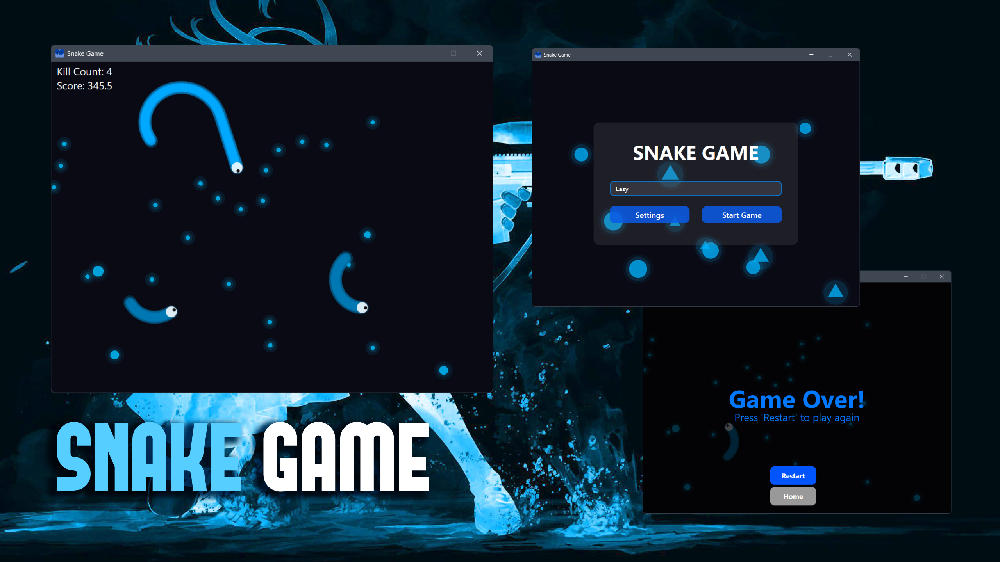
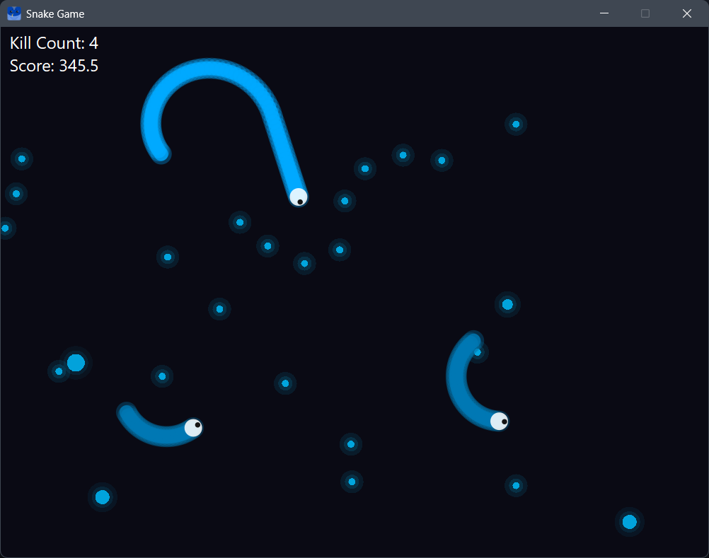
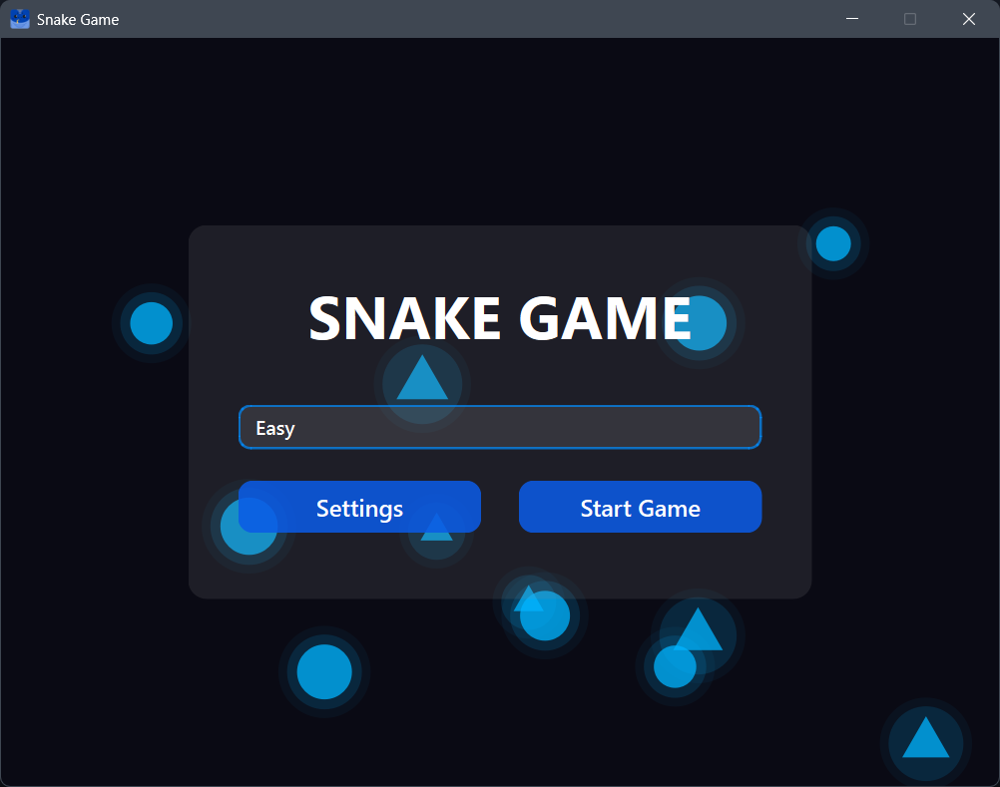
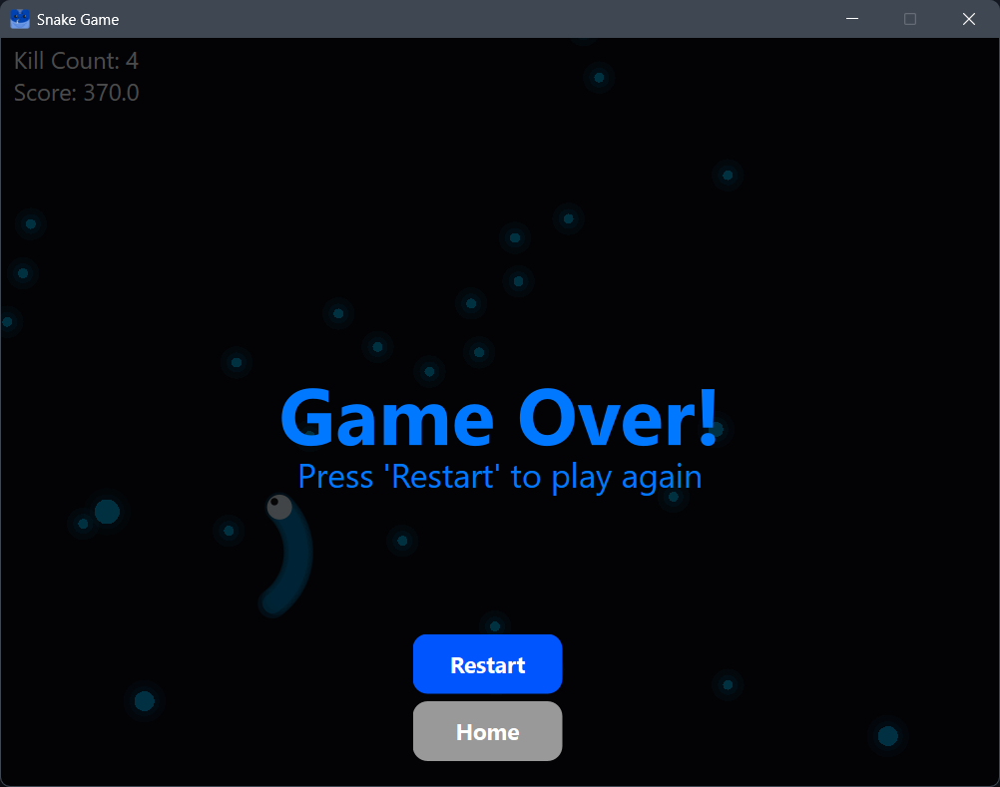

<p align="center">
  
</p>

<h1 align="center">🐍 Snake Game</h1>
<p align="center">
  <strong>A neon-style desktop snake arena game built with Python and PyQt6.</strong>
</p>

<p align="center">
  
  
  
  
</p>

## Overview

Snake Game is a modern desktop arcade game inspired by the classic snake formula, redesigned as a glowing arena battle. The player controls a blue snake, collects food, grows longer, avoids collisions, and competes against AI-controlled bot snakes.

The project uses PyQt6 instead of a traditional game engine. It demonstrates custom widget painting, timers, keyboard input, audio playback, menu navigation, simple AI steering, and real-time collision logic in a single Python application.

## Features

- Neon snake arena with custom `QPainter` rendering.
- Animated startup screen with gradient background and floating shapes.
- Glass-style menu panel and animated hover buttons.
- Difficulty selector with Easy, Medium, and Hard modes.
- Settings dialog for custom player speed and bot speed.
- AI bot snakes that chase the nearest food.
- Food items with different sizes and point values.
- Player score and kill-count HUD.
- Continuous wrap-around arena movement.
- Speed-boost behavior while turning with arrow keys.
- Food-drop mechanic during speed boosts.
- Bot respawn system after bot deaths.
- Game-over overlay with Restart and Home controls.
- Startup music, gameplay music, and game-over audio.
- Window icon, thumbnail, banner, and screenshot assets included.

## Screenshots

<table>
  <tr>
    <td align="center" colspan="2"></td>
  </tr>
  <tr>
   <td align="center"></td>
    <td align="center"></td>
  </tr>
</table>

## Technology Stack

| Area | Technology |
| --- | --- |
| Language | Python |
| GUI Framework | PyQt6 |
| Rendering | `QPainter`, `QColor`, `QPolygonF`, custom widgets |
| Timing | `QTimer` game loop |
| Audio | `QMediaPlayer`, `QAudioOutput` |
| Input | PyQt6 keyboard events |
| Runtime File | `main.py` |

## Project Structure

```text
snake-game/
├── .gitattributes
├── LICENSE
├── README.md
├── main.py
├── banner.png
├── assets/
│   ├── images/
│   │   ├── icon.ico
│   │   └── icon.png
│   └── sounds/
│       ├── game_music.mp3
│       ├── game_over.mp3
│       └── startup.mp3
└── screenshots/
    ├── 1.png
    ├── 2.png
    └── 3.png
```


## Installation

### Prerequisites

- Python 3.10 or newer
- `pip`

### 1. Open the Project Folder

```bash
cd snake-game
```

### 2. Install Dependencies

```bash
pip install PyQt6
```

### 3. Run the Game

```bash
python main.py
```

On some systems, use:

```bash
python3 main.py
```

## Controls

| Action | Key / Input |
| --- | --- |
| Turn left | `Left Arrow` or `A` |
| Turn right | `Right Arrow` or `D` |
| Trigger/maintain speed boost | Arrow keys while score is available |
| Select difficulty | Startup dropdown |
| Open speed settings | `Settings` button |
| Start game | `Start Game` button |
| Restart after game over | `Restart` button |
| Return to menu | `Home` button |


## License

This project is licensed under the MIT License. See [LICENSE](LICENSE) for details.

## Author

Ashish Kumar
